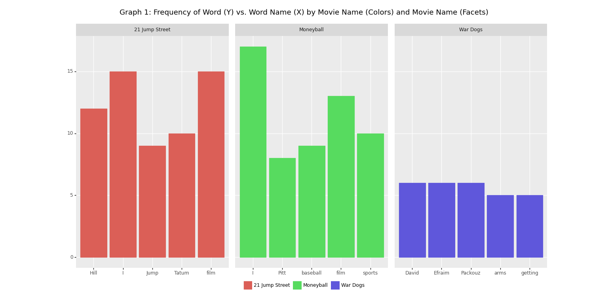
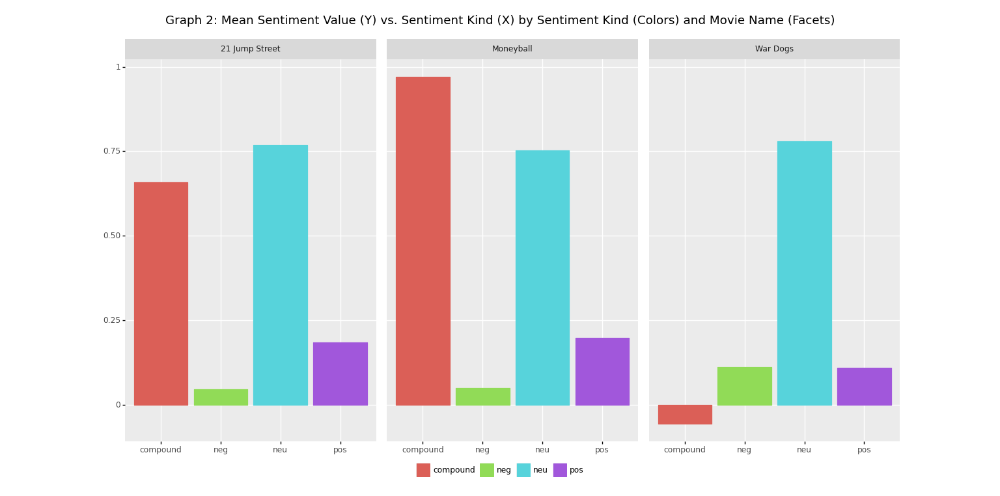

# Project Writeup

## Project Overview

In this project, I sought to collect analyze data from the ratings of three movies (War Dogs, Moneyball, and 21 Jump Street) starred by my favorite artist, Jonah Hill. More specifically, I choose to scrape five reviews from IMDB using the Cinemagoer package, and subsequently conduct analysis on the most used words from reviews as well as the sentiment scores related to those reviews based on NLP techniques. After using cinemagoer to scrape those reviews, I transformed these sources into the appropriate data sources, such as sorted dictionaries and lists, in order to further manipulate them using Pandas. Since I am relatively well-versed in R, I especially hoped to better my understanding in using Pandas to manipulate dataframes in Python, as well as how to use the plotline package to construct beautiful graphs. Furthermore, I wanted to also understand how the sentiment values derived from NLP techniques compared to my own priors regarding those movies.

## Implementation

As mentioned before, the cinemagoer Python package was used to scrape the movie reviews from IMDB. To do this, I searched for each of the movie names using the search functions provided by the package, then accessed each of the reviews by accessing their respective dictionary element and transforming them into lists. There were two main goals then: (1) to create a histogram based on the top N (in my case, 5) words from each of the K (in my case, 5) movie reviews, as well as (2) estimate the sentiment scores linked to each of these reviews. 

To accomplish the first goal, I transformed each of the (now listed) reviews into dictionaries, and created sorted those dictionaries from high to low for the top 5 words. Since I did not want to include any stopwords, I filtered only for words not contained in the set of stopwords inside the for loop. This sorted dictionary was then transformed into a list containing word:frequency pairs. An alternative in this case would have been to simply return a dictionary or a tuple, but I choose to return a list to make it easier to transform it into a Pandas dataframe for further manipulation. Moreover, I thought about transforming the list into a numpy array, but changed my mind. Either way, the list would have more easily allowed for the final transformation into an object that is accepted by plotline.

With regards to the second goal, the process was relatively similar. Since I had a list of five reviews, I created a for loop to read through each of them so that the polarity scores derived from the nltk package could be derived. What was most different from the first part was that I now also wanted to do some data manipulation with the values derived, that is, calculated the mean score for each sentiment category and group. After deriving these scores, I then had to somehow merge these different dataframes into one. There were multiple alternatives for this, such as concatenating each of the dataframes, but I choose to simply append each of the lists/dataframes into each other so that I would be able to conduct the data analysis desired. The necessity for data manipulation lead to myself having to do some research on how to manipulate dataframe in Python in a similar fashion to R's dplyr package. I eventually was able to achieve my final goal and plot the mean value for each sentiment score and movie.

## Results

The first part of the text analysis was the histogram of word counts. I had initially hoped that, conditional on removing stopwords, the words used most frequently in reviews would be useful in providing information related to critic's perspectives. Nonetheless, the most frequent words were mostly related to the actors' names and the movie titles. For instance, the most frequent words used on Moneyball were "Pitt", "Baseball", "film", and "sports" which are obvious words given the movie title and actors. This may pose an obvious question: why not simply also remove those words and see what results can be derived after doing so? It just so happens that these most frequent words were also not used that extensively -- they amount to only being used around 10 times for 21 Jump Street and Moneyball, and just five times for War Dogs, on average. 

Once again, let me be clear in stating that my primary objective with this project was to understand critics' reviews about movies starring Jonah Hill. Given the poorly informative results of the histogram, I decided to estimate the polarity scores using the nltk package. Perhaps as expected, these were much more informative. Though War Dogs is my favorite movie out of this set of movies, I was surprised to see that War Dogs had the lowest mean positive sentiment score out of the three movies. The mean positive sentiment score was about twice as high for the two other movies in comparison to War Dogs. Furthermore, though the mean neutrality score of War Dogs is fairly similar to the other two movies, War Dogs stands out as being the only movie with a negative mean compounded score (which ranges from -1 to 1) -- Moneyball is almost at 1, and 21 Jump Street is approximately at 0.6.

## Reflection
From a process point of view, I felt like what went best was my ability to generalize and parametrize my code. For instance, the parameters used in the functions I created can be easily changed and will generate the same graph for any number of dimensions I would like -- such as the top 10 words instead of 5, or the top 10 reviews instead of 5. I feel like I can most improve in my ability to manipulate dataframes in Python and choose the appropriate data structures. Though this difficulty was perhaps expected since we did not cover this in the course, I feel like I had to spend a considerable amount of time in trying to understand how to go from manipulating data in R to manipulating it in Python. Furthermore, as it pertains to actual NLP processes, I feel like I would have been much better able to interpret the output of my code had I actually understood the estimation of sentiment scores from nltk. Broadly speaking, I believe that knowing how an algorithm works helps in understanding its results and what causes them to be in that way. I work as a data scientist and Python is beginning to take up much more space in my tooolbox, and I now feel like I am much better able to transition between R and Python than before, especially when Python is more suited for the tasks (in my opinion) like in machine learning. I did wish I knew how to use a bit of pandas and numpy before starting this project.